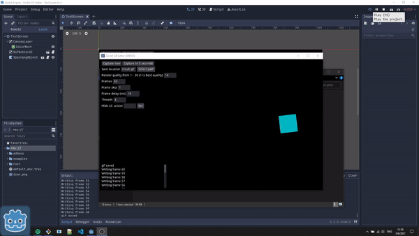
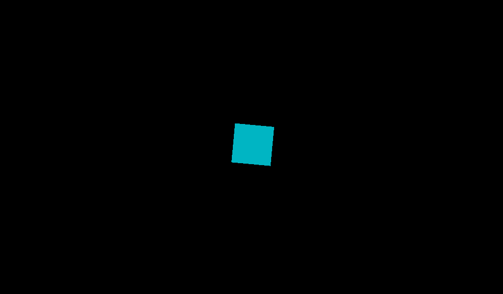
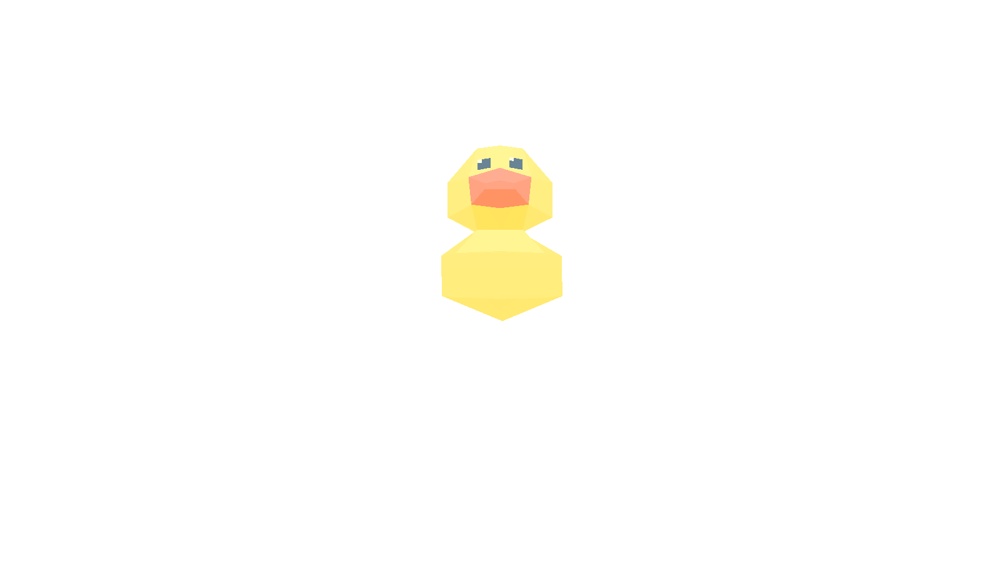

# Godot Gif Getter
An ingame utility for recording and saving gifs for Godot.

Requires very little configuration to actually use. Just drop the scene into your project and the default settings should be good enough. The frame rate, save location, capture frequency, threads, and ui toggle hotkey can all be configured in the UI. 

Uses the [image-gif](https://github.com/image-rs/image-gif) Rust library for encoding gifs.

It's pretty fast. The below gif of a gif capture shows the program using 4 threads to render 60 frames.

The resulting gif.

Used to make use of [godot-gdgifexporter](https://github.com/jegor377/godot-gdgifexporter) for gif creation. That was too slow for longer gifs.

Inspired by [this reddit thread](https://www.reddit.com/r/godot/comments/lv7pon/not_for_a_game_but_i_made_a_short_animation_using/).

## Quickstart
Add `addons/godot-gif-getter/GifGetterUI.tscn` to your scene. Click on the 'Capture now' button in the top left corner. Wait for the gif to be processed and saved.

The UI is automatically hidden when recording frames.

## Limitations
- If you are using transparent backgrounds in your project, gifs will not capture correctly. It's still kinda cool but probably not expected.

- Cross-compilation is not supported. You can currently build on windows and mac.
    - Mac built for version: `Big Sur 11.5.2`

## Building
- Install [rust](https://www.rust-lang.org/tools/install)
- Run `${REPO_ROOT}/build-and-move-dll.sh`
- Copy or soft symlink `${REPO_ROOT}/addons/godot-gif-getter` to `${YOUR_PROJECT_ROOT}/addons/godot-gif-getter`

## License
See [LICENSE](LICENSE).
